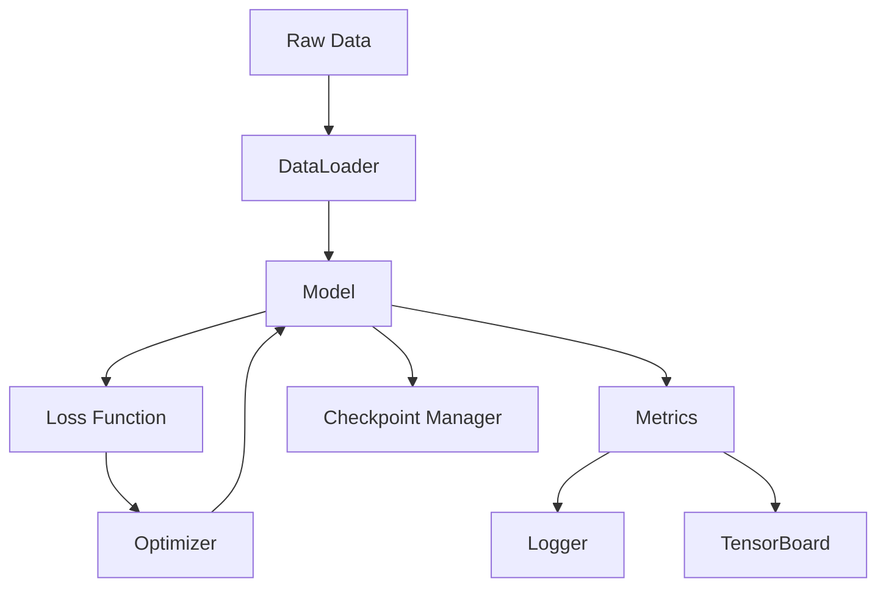

# Project Architecture

## Overview

This PyTorch project follows a modular architecture designed for scalability, maintainability, and ease of use. The codebase is organized into separate modules with clear responsibilities.

## Directory Structure

```
Pytorch/
├── src/                      # Main source code
│   ├── config.py            # Configuration management
│   ├── logger.py            # Logging utilities
│   ├── train.py             # Training script
│   ├── inference.py         # Inference script
│   ├── models/              # Model definitions
│   │   ├── simple_nn.py     # Simple neural network
│   │   └── __init__.py
│   └── utils/               # Utility modules
│       ├── checkpoint.py    # Checkpoint management
│       ├── metrics.py       # Metrics calculation
│       ├── model.py         # Model utilities
│       ├── data.py          # Data utilities
│       ├── visualization.py # Visualization tools
│       └── __init__.py
├── tests/                    # Test files
├── examples/                 # Usage examples
├── docs/                     # Documentation
├── data/                     # Dataset directory
├── models/                   # Saved models
└── outputs/                  # Training outputs
    ├── logs/                # Training logs
    └── checkpoints/         # Model checkpoints
```

## Module Descriptions

### Configuration (`config.py`)

Centralized configuration management using dataclasses:

- **PathConfig**: Manages all project paths
- **ModelConfig**: Model architecture parameters
- **TrainingConfig**: Training hyperparameters
- **DeviceConfig**: Compute device configuration

### Logging (`logger.py`)

Structured logging system with:

- File and console output
- Metrics tracking
- TensorBoard integration

### Models (`models/`)

Neural network architectures:

- Modular design for easy extension
- Well-documented with docstrings
- Type-hinted interfaces

### Utilities (`utils/`)

Common functionality:

- **checkpoint.py**: Model saving/loading with versioning
- **metrics.py**: Performance metrics and tracking
- **model.py**: Model manipulation utilities
- **data.py**: Data loading and preprocessing
- **visualization.py**: Training visualization

## Data Flow



## Key Design Principles

1. **Separation of Concerns**: Each module has a single, well-defined responsibility
2. **Configuration-Driven**: All parameters centralized in config
3. **Type Safety**: Comprehensive type hints throughout
4. **Documentation**: Docstrings for all public interfaces
5. **No Comments**: Code is self-documenting with clear naming
6. **Testability**: Modular design enables easy testing
7. **Extensibility**: Easy to add new models and utilities

## Best Practices

- Use configuration classes instead of hard-coded values
- Leverage the checkpoint manager for model versioning
- Utilize the metrics logger for tracking experiments
- Follow type hints for better IDE support
- Keep models in the models/ directory
- Add utility functions to appropriate util modules
